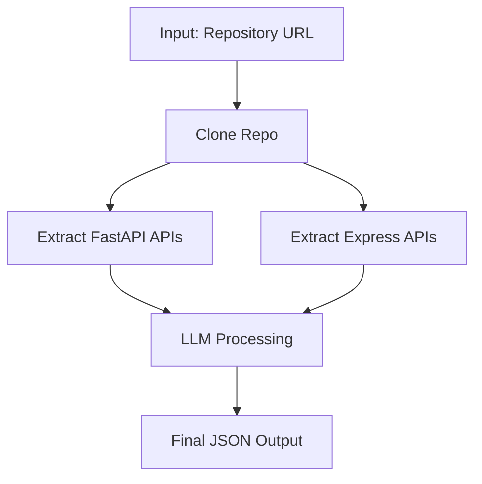

# Github Repo API Extractor

A robust API extraction tool that analyzes FastAPI and Express-based repositories to extract and structure API endpoints with minimal human intervention.

## Overview

This project uses **LangGraph** and **Tree-Sitter** AST analysis combined with LLM-powered extraction to automatically discover and document APIs in **FastAPI** and **Express** codebases. The tool extracts endpoint information including paths, methods, request/response schemas, and descriptions.

**LangSmith** is integrated for comprehensive monitoring, debugging, and error resolution throughout the extraction pipeline, providing visibility into workflow execution and LLM interactions.

> **Note:** This tool covers a substantial portion of APIs but does not guarantee 100% extraction. Complex API designs may not be fully captured.

## Features

- ✅ **FastAPI Support** - Extracts decorated endpoints from FastAPI applications
- ✅ **Express Support** - Parses Express.js route definitions
- ✅ **Structured Output** - Returns JSON with endpoint details (method, path, schemas, descriptions)
- ✅ **Batch Processing** - Efficiently processes multiple endpoints using LLM with retry logic
- ✅ **AST-Based Analysis** - Uses Tree-Sitter for accurate code parsing
- ✅ **LangSmith Integration** - Built-in monitoring and debugging for workflow execution

## Monitoring & Debugging with LangSmith

This project uses **LangSmith** to provide comprehensive monitoring, debugging, and error resolution capabilities:

- **Tracing** - Track the complete workflow execution from repo cloning through API extraction
- **Debugging** - Inspect LLM interactions, prompts, and responses in real-time
- **Error Resolution** - Quickly identify and diagnose issues in the extraction pipeline
- **Performance Analytics** - Monitor batch processing performance and LLM API usage

Enable LangSmith tracing by setting the environment variables during installation.

## Installation

1. **Clone the repository and set up virtual environment:**
   ```bash
   # Create Python virtual environment
   python -m venv <venv_name>
   
   # Activate virtual environment (Windows)
   .\<venv_name>\Scripts\Activate.ps1
   
   # Or on Linux/Mac
   source <venv_name>/bin/activate
   ```

2. **Install dependencies:**
   ```bash
   pip install -r requirements.txt
   ```

3. **Set up environment variables:**
   Create a `.env` file in the root directory:
   ```
   MISTRAL_API_KEY=your_mistral_api_key_here
   LANGSMITH_TRACING=true
   LANGSMITH_ENDPOINT="https://api.smith.langchain.com"
   LANGSMITH_API_KEY=<langsmith_api_key>
   LANGSMITH_PROJECT=<langsmith_project_name>
   ```

## Usage

Modify the repository URL in `main.py` and run:

```bash
python main.py
```

**Example:**
```python
url = "https://github.com/juice-shop/juice-shop"
response = workflow.invoke({
    "repo_url": url, 
    "repo_path": "./repo_juice-shop"
})
```

## Workflow Architecture



## Output Format

The tool generates structured JSON with the following schema:

```json
{
  "final_output": [
    {
      "framework": "FastAPI",
      "endpoint": "/api/users/{id}",
      "method": "GET",
      "description": "Fetch user by ID",
      "request_schema": {"type": "string", "properties": "string", "additionalProperties": "boolean"},
      "response_schema": {"id": "string", "name": "string", "email": "string"}
    },
    {
      "framework": "Express",
      "endpoint": "/api/products",
      "method": "POST",
      "description": "Create new product",
      "request_schema": {"type": "string", "properties": "string", "additionalProperties": "boolean"},
      "response_schema": {"id": "string", "name": "string", "price": "number"}
    }
  ]
}
```

## Known Limitations

- **Complex API Designs** - APIs with highly complex or unconventional structures may not be fully extracted due to AST parsing limitations
- **Dynamic Routes** - Runtime-generated endpoints are difficult to detect statically
- **Indirect Dependencies** - APIs defined through complex meta-programming patterns may be missed
- **Language Coverage** - Only FastAPI (Python) and Express (JavaScript/TypeScript) are supported

## Requirements

- Python 3.8+
- Mistral AI API Key
- Dependencies listed in `requirements.txt`

## Performance Notes

- Processing time varies based on repository size and batch size
- Batch size 9 typically offers optimal throughput (~2-2.5 minutes for ~100 APIs)
- Rate limiting may occur with LLM API calls

## License

[Add your license here]
